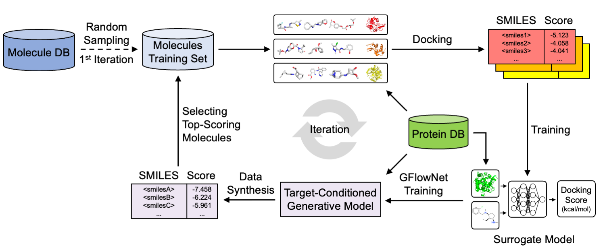

Abstract: The emergence of virtual libraries and generative models enables the exploration of the uncharted chemical space, offering new opportunities for novel drug discovery. However, the high computational cost of molecular docking for estimating the binding affinity of small molecules against target proteins presents a bottleneck in this process. While various machine learning approaches have introduced active learning with surrogate models of docking, their applicability is often restricted to single targets. Here, we introduce DOCKSURR, a pre-trained docking surrogate that predicts docking scores for arbitrary protein-ligand pairs. The model is trained on a large-scale random-docking database using GPU-accelerated docking. We then incorporate active learning using a pocket-conditioned generative policy to improve accuracy for high-affinity molecules in sparse chemical distributions. Experimental results demonstrate that DOCKSURR provides a significant speed-up of 20x in molecular optimization, paving the way for more efficient structure-based drug discovery.

