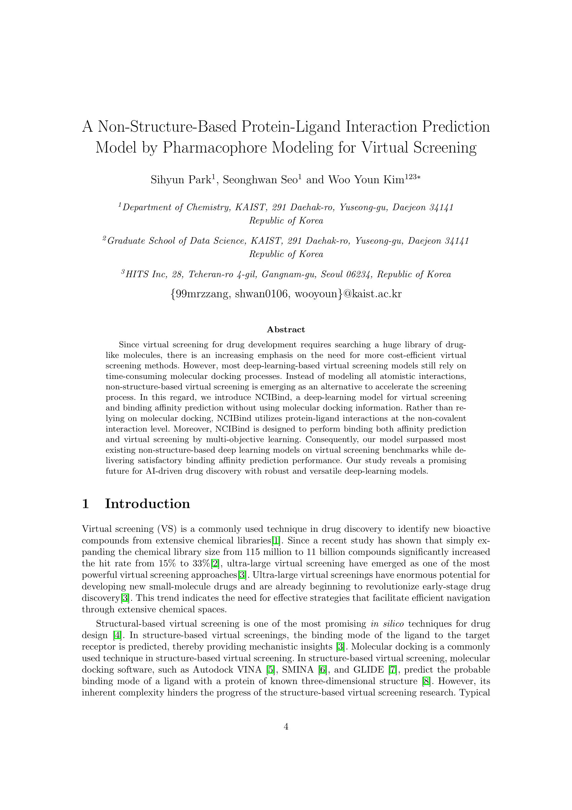

Abstract: Since virtual screening for drug development requires searching a huge library of drug- like molecules, there is an increasing emphasis on the need for more cost-efficient virtual screening methods. However, most deep-learning-based virtual screening models still rely on time-consuming molecular docking processes. Instead of modeling all atomistic interactions, non-structure-based virtual screening is emerging as an alternative to accelerate the screening process. In this regard, we introduce NCIBind, a deep-learning model for virtual screening and binding affinity prediction without using molecular docking information. Rather than re- lying on molecular docking, NCIBind utilizes protein-ligand interactions at the non-covalent interaction level. Moreover, NCIBind is designed to perform binding both affinity prediction and virtual screening by multi-objective learning. Consequently, our model surpassed most existing non-structure-based deep learning models on virtual screening benchmarks while de- livering satisfactory binding affinity prediction performance. Our study reveals a promising future for AI-driven drug discovery with robust and versatile deep-learning models.

