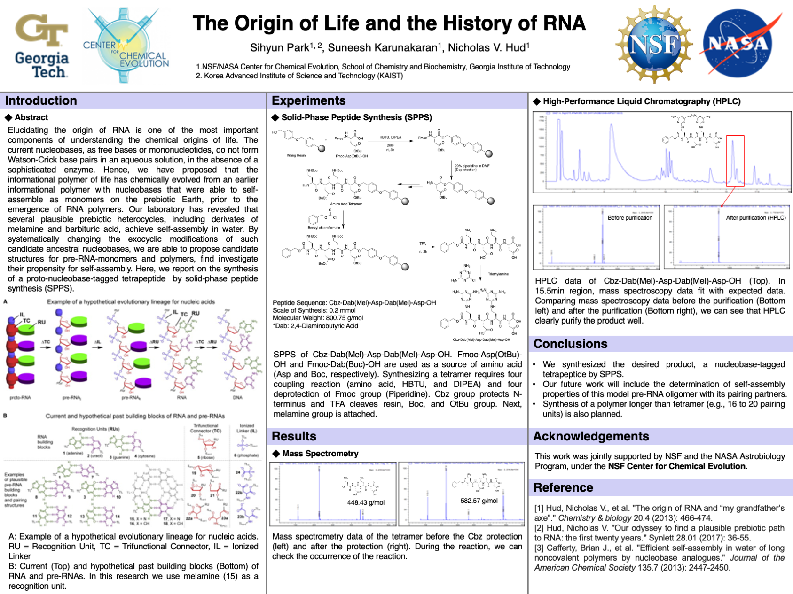

Abstract: Elucidating the origin of RNA is one of the most important components of understanding the chemical origins of life. The current nucleobases, as free bases or mononucleotides, do not form Watson-Crick base pairs in an aqueous solution, in the absence of a sophisticated enzyme. Hence, we have proposed that the informational polymer of life has chemically evolved from an earlier informational polymer with nucleobases that were able to self-assemble as monomers on the prebiotic Earth, prior to the emergence of RNA polymers. Our laboratory has revealed that several plausible prebiotic heterocycles, including derivates of melamine and barbituric acid, achieve self-assembly in water. By systematically changing the exocyclic modifications of such candidate ancestral nucleobases, we are able to propose candidate structures for pre-RNA-monomers and polymers, find investigate their propensity for self-assembly. Here, we report on the synthesis of a proto-nucleobase-tagged tetrapeptide  by solid-phase peptide synthesis (SPPS).

