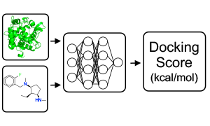
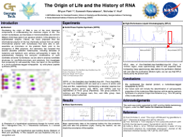

  <!-- Card 1 -->
  <a href="card1" class="card" target="_blank">
    
    

      <h3 class="card-title">DockSuRR: Pre-training Docking Surrogate via Target-aware Generative Active Learning</h3>
      
Intelligent Chemistry Lab, KAIST

    

  </a>

  <a href="card2" class="card" target="_blank">
    
    

      <h3 class="card-title">The Origin of Life and the History of RNA</h3>
      
Hub Lab, Georgia Tech

    

  </a>

